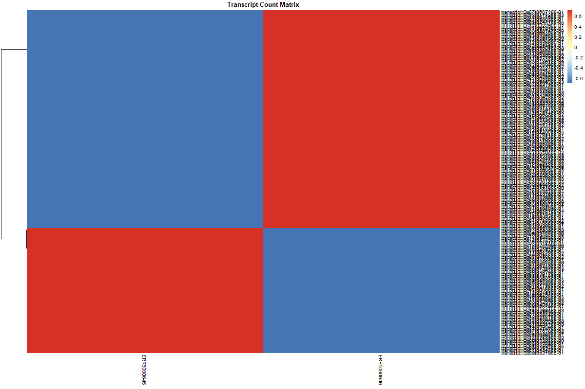
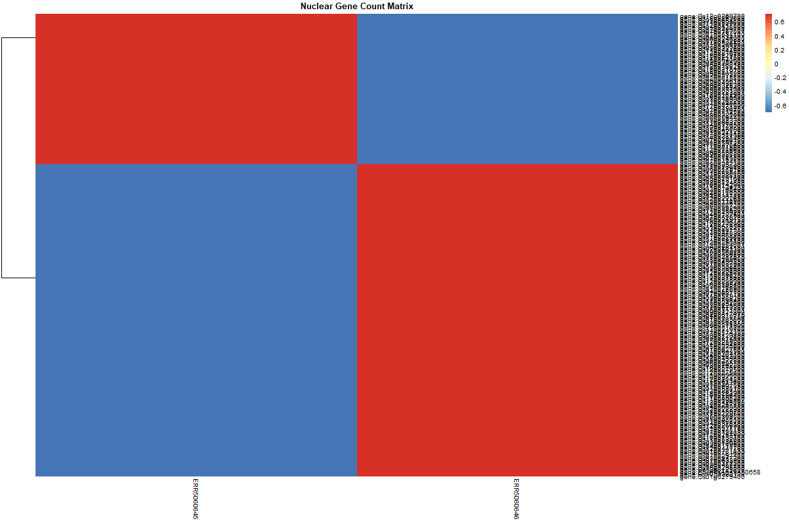
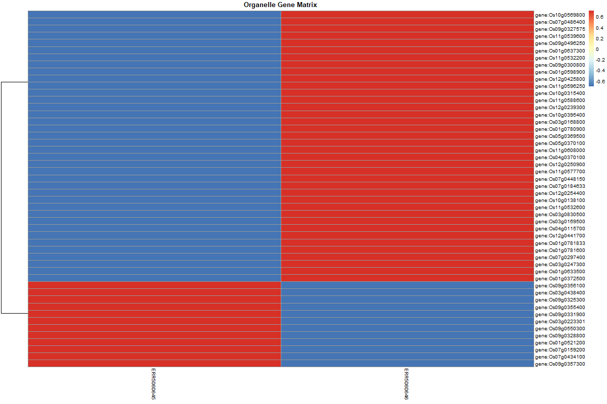

# Bulk RNA-seq Analysis Repository

This repository contains quality control reports, count matrices, scripts, and visualizations from bulk RNA-seq analysis. It provides a reproducible workflow for RNA-seq data processing and visualization.

This study focuses on **comparing gene expression patterns between Black Rice (*Oryza sativa indica*) and White Rice (*Oryza sativa japonica*)**. The datasets include transcript and gene counts for both rice types, along with quality control metrics and visualizations.

---

## Repository Structure

```bash
RNAseq_Analysis/
│
├── 01_QC_Reports/ # FastQC HTML reports for sequencing reads
├── 02_QC_Plots/ # PNG visualizations for quality metrics
├── 03_Count_Matrices/ # Transcript/gene count matrices & scripts
│ ├── transcript_count_matrix.csv
│ ├── nuclear_gene_count_matrix.csv
│ ├── Organelle_gene_count_matrix.xlsx
│ ├── prepDE.py
│ └── Bulk_RNA_seq.sh
├── 04_Heatmaps/ # Heatmaps of gene expression patterns
│ ├── Transcript_Heatmap.png
│ ├── Nuclear_Gene_Heatmap.png
│ └── Organelle_Heatmap.png
└── README.md
```

---

## Tools Used

- **FastQC**: Quality control for raw sequencing reads  
- **Python (`prepDE.py`)**: Extract transcript/gene count matrices  
- **Bash (`Bulk_RNA_seq.sh`)**: Automates RNA-seq workflow  
- **Visualization Tools**: Heatmaps and QC plots, performed in IDEp and Python  

---

## Study Overview

- **Species**:  
  - Black Rice: *Oryza sativa indica*  
  - White Rice: *Oryza sativa japonica*  

- **Objective**: Identify differential gene expression patterns between Black Rice and White Rice.  

- **Data**: Raw RNA-seq reads, QC metrics, transcript and gene count matrices, and heatmaps.  

- **Methodology**:  
  - Performed bulk RNA-seq of *Oryza sativa* (pigmented vs. non-pigmented)  
  - Processed ∼17 million paired-end reads via Linux pipelines  
  - Analyzed large-scale sequencing data for quality and expression patterns
  
- **Analysis Steps**:  
  1. Assess sequencing quality (FastQC reports & QC plots)  
  2. Generate transcript/gene count matrices using `prepDE.py`  
  3. Visualize expression patterns via heatmaps
  
| Transcript | Nuclear | Organelle |
|------------|--------|-----------|
|  |  |  |

  4. Compare gene expression between the two rice types
